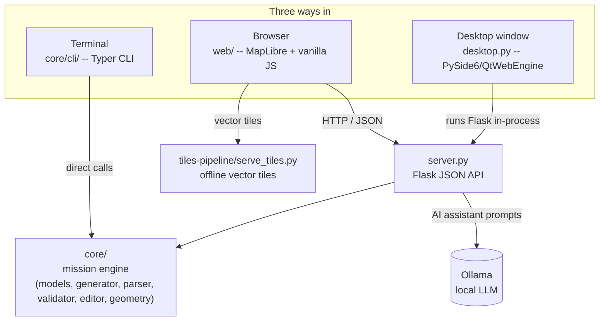

# Aeronis

An open-source tool for planning, editing and exporting DJI drone waypoint missions, with no paid API and no proprietary software required.

It ships as a web app (Flask + [MapLibre GL](https://maplibre.org/)), a desktop app (the same web app wrapped with PySide6/QtWebEngine), and a standalone CLI.

## Why this project exists

DJI provides official mission planning tools such as FlightHub 2 and DJI Pilot 2, but these come with real limitations: subscription fees, closed ecosystems, and no straightforward way to programmatically create or edit mission files from your own code.

This project fills that gap with a free, transparent, developer-friendly alternative that gives full control over the `.kmz` mission files DJI drones actually fly.

It's developed as part of an internship at the Universitat Politècnica de València focused on UAV software tools and geospatial data processing.

## Features
 
- **Interactive mission planning** -- draw rectangular or polygon coverage zones on the map; waypoints are generated automatically with a lawnmower/serpentine pattern
- **Manual waypoint editing** -- add, move, delete and reorder waypoints directly on the map, with live undo/redo
- **Automatic mission splitting** -- zones that would exceed 200 waypoints (the point at which the RC2 controller becomes unreliable) are split into several missions automatically
- **Photo and video capture modes** -- camera trigger spacing is computed from real DJI camera specs (sensor size, focal length, resolution) for a target overlap or GSD
- **KMZ import/export** -- load an existing DJI mission to inspect or edit it, export single or multiple missions (bundled as a `.zip`)
- **Offline maps** -- self-hosted vector tiles via a lightweight `.mbtiles` server, for use without an internet connection
- **Local AI assistant** -- describe a mission or an edit in plain language ("survey the field east of the barn at 80m, 85% overlap") and have it turned into waypoints, powered by a local [Ollama](https://ollama.com) model -- no cloud API, no data leaving your machine
- **CLI** -- the same mission engine (`core/`) exposed as a scriptable command-line tool, for automation and batch processing
## Architecture at a glance
 

 
`core/` has no knowledge of Flask, the CLI, or Qt -- it's a plain Python library for building, parsing, validating and editing DJI missions. Everything else is a thin frontend on top of it. See the [developer guide](docs/DEVELOPER_GUIDE.md) for details.
 
## Quick start
 
### Web app, with Docker (recommended)
 
```bash
make build
make up
```
 
Then open `http://localhost:8000`. `make logs` tails both containers, `make down` stops them. See [docs/DEPLOYMENT.md](docs/DEPLOYMENT.md) for the offline tiles setup, Ollama networking, and environment variables.
 
### Web app, without Docker
 
```bash
pip install -e . --break-system-packages
python server.py
```
 
Open `http://127.0.0.1:5000`. Offline tiles and the AI assistant are optional and degrade gracefully if not configured -- see the deployment guide.

To use offline maps, also start the tile server in parallel (you need to provide your own `.mbtiles` file in `tiles-pipeline/data/` first -- see [docs/DEPLOYMENT.md](docs/DEPLOYMENT.md#offline-map-tiles)):

```bash
cd tiles-pipeline
python serve_tiles.py
```

By default it serves `./data/spain.mbtiles` on `http://127.0.0.1:8765`; pass a different path and/or port as arguments (`python serve_tiles.py <path> <port>`) to override.
 
### Desktop app
 
```bash
pip install -e . PySide6 --break-system-packages
python desktop.py
```
 
Runs the same Flask app in a background thread inside a native window -- no separate server to manage. It also starts the offline tile server automatically in the background if a `.mbtiles` file is present at `tiles-pipeline/data/spain.mbtiles`.
 
### CLI
 
```bash
pip install -e . --break-system-packages
aeronis --help
```
 
Full reference in [docs/CLI_DOCUMENTATION.md](docs/CLI_DOCUMENTATION.md).
 
## Documentation
 
| Guide | Audience | Covers |
|---|---|---|
| [User Guide](docs/USER_GUIDE.md) | Pilots / end users | Using the web app: drawing zones, editing waypoints, capture modes, import/export, the AI assistant |
| [CLI Documentation](docs/CLI_DOCUMENTATION.md) | End users / scripters | Every CLI command, options, CSV format, troubleshooting |
| [Developer Guide](docs/DEVELOPER_GUIDE.md) | Contributors | Project layout, `core/` module reference, API reference, extending the tool |
| [Deployment Guide](docs/DEPLOYMENT.md) | Operators | Docker Compose, offline tile generation, Ollama networking, environment variables |
 
## Project structure
 
| Path | What's there |
|---|---|
| `core/` | Mission engine: models, KMZ generation/parsing, validation, editing, geometry, LLM planning. (`elevation.py` also lives here but isn't wired into the CLI, API, or frontend yet -- see the [developer guide](docs/DEVELOPER_GUIDE.md).) |
| `core/cli/` | Typer-based CLI on top of `core/` |
| `server.py` | Flask app: JSON API for the web frontend + static file serving |
| `desktop.py` | PySide6/QtWebEngine shell running `server.py` in-process |
| `web/` | Frontend: MapLibre map, waypoint/zone editing, AI assistant panel |
| `tiles-pipeline/` | Offline vector tile server + OSM tile downloader |
| `samples/` | Example `.kmz` missions for testing/import |
 
## License
 
This project is developed for educational and research purposes as part of a university internship. It is not affiliated with or endorsed by DJI.
 
## Authors and acknowledgment
 
Lukas Damour